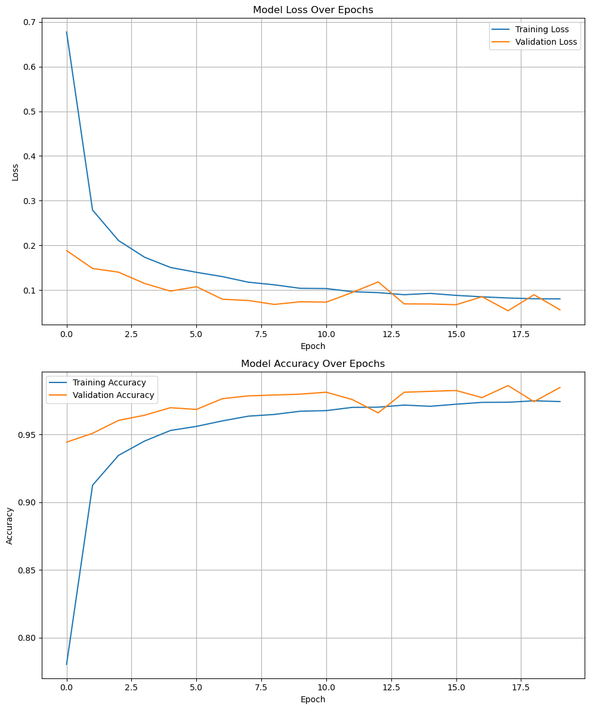

# CNN for MNIST Digit Recognition

## 🎯 Project Goal

This project builds upon foundational machine learning by developing a custom **Convolutional Neural Network (CNN)** to solve the classic MNIST handwritten digit recognition problem. The primary goal is to architect, train, and evaluate a deep learning model from scratch, and then deploy it as an interactive, high-performance web application using **TensorFlow.js** for client-side inference.

This end-to-end project involves:
1.  **Custom CNN Architecture:** Designing a deep network following modern principles.
2.  **Data Augmentation:** Implementing an on-the-fly augmentation pipeline to improve model robustness.
3.  **Advanced Training:** Utilizing Keras callbacks for efficient training and model checkpointing.
4.  **Model Conversion & Deployment:** Converting the final model to a web-friendly format and deploying it for real-time, in-browser predictions.

## ✅ Solution Details

### 🧮 Performance Measure
To evaluate and select the best model, the following metrics were used:
- **Accuracy**: To measure the percentage of correct predictions.
- **Weighted F1 Score**: To balance precision and recall across all classes.
- **Class-wise F1 Score & Confusion Matrix**: To analyze the model's performance on individual digits and identify specific weaknesses.
- **Learning Curves (Loss & Accuracy vs. Epochs)**: To diagnose model behavior (e.g., underfitting, overfitting, convergence) during training.

### 🚧 Data Transformation
- **Normalization:** Pixel values were rescaled from the `[0, 255]` range to the `[0, 1]` range using a `tf.keras.layers.Rescaling` layer.
- **Data Augmentation:** To improve generalization and prevent overfitting, a pipeline of random transformations was built directly into the model. This was applied on-the-fly during training and included:
    - `RandomTranslation`: To handle digits not being perfectly centered.
    - `RandomZoom`: To make the model robust to variations in digit size.
    - `RandomRotation`: To account for slight tilts in handwriting.

### 📂 Dataset
The standard MNIST dataset, containing 70,000 grayscale images of handwritten digits, was used for this project.

### 🧠 Model Insights

#### Production Model:
* **Algorithm**: Custom-built Convolutional Neural Network (CNN).
* **Performance**:
    * Weighted F1 Score: **~0.99**
    * Accuracy: **~0.99**
* **Architecture**:
    * The model follows a standard CNN design pattern, progressively decreasing spatial dimensions while increasing channel depth.
    * **Structure**: `(Conv -> Conv -> Pool) x 3 -> Flatten -> Dense -> Output`
    * **Activations**: `ReLU` for all hidden layers and `Softmax` for the final 10-class output layer.
* **Training Details**:
    * **Loss Function**: `SparseCategoricalCrossentropy`, as the labels were integers.
    * **Optimizer**: `Adam`.
    * **Callbacks**: Utilized `ModelCheckpoint` to save the best model based on `val_accuracy` and `EarlyStopping` to prevent wasteful computation after convergence.
* **Deployment**:
    * The final trained Keras model was converted to the **`tfjs_graph_model`** format for robust and high-performance client-side inference.

#### Observations:
* The custom CNN model achieved performance on par with, or slightly better than, traditional ML models like SVC, demonstrating the power of spatially-aware architectures for image data.
* The model was trained for over 100 epochs, with analysis showing that the best performance was achieved around epoch 75, after which overfitting began to occur. This highlighted the importance of using `ModelCheckpoint` and `EarlyStopping`.

### 💻 Tech Stack

## Screen Shots

### Data Augmentation
#### Sample Digits

#### Random Rotations

#### Random Translations

#### Random Zoom

### Tranining & Evaluations

#### Experiment 1 - Default CNN

#### Experiment 2 - Default CNN

#### Experiment 3 - Default CNN

## 🏫 Lessons Learned

1.  **Deep Learning Workflow:**
    * Mastered the end-to-end Keras workflow: `Define -> Compile -> Fit -> Evaluate`.
    * Gained deep practical experience with **Keras Callbacks**, understanding how `ModelCheckpoint` and `EarlyStopping` are essential for efficient training and selecting the best model, not just the last one.
    * Learned to diagnose model behavior (underfitting vs. overfitting) by plotting and analyzing **learning curves** from the `history` object.

2.  **CNN Architecture:**
    * Solidified the intuition behind **hierarchical feature learning**, where early layers detect simple edges and later layers combine them into complex shapes.
    * Understood and applied standard design principles: progressively increasing filter depth while decreasing spatial dimensions using `MaxPooling`.

3.  **TensorFlow & Deployment:**
    * Navigated and debugged complex model serialization issues, learning the critical difference between `model.save()` (for training checkpoints) and **`model.export()`** (for deployment).
    * Understood the trade-offs between the `tfjs_layers_model` and **`tfjs_graph_model`** formats, identifying the latter as more robust for deployment.
    * Successfully created a full-stack application with a **client-side inference** model, a key skill for building modern, scalable AI web apps.

## 🚀 Project Highlights

* **Custom CNN from Scratch:** The entire network architecture was designed and implemented in TensorFlow/Keras, not just fine-tuned.
* **End-to-End Deployment:** The project covers the full lifecycle, from data augmentation and training in a Python notebook to a live, interactive web application using Next.js and TensorFlow.js.
* **Client-Side Inference:** The final model runs entirely in the user's browser, offering a fast, private, and scalable user experience without needing a powerful backend server for predictions.